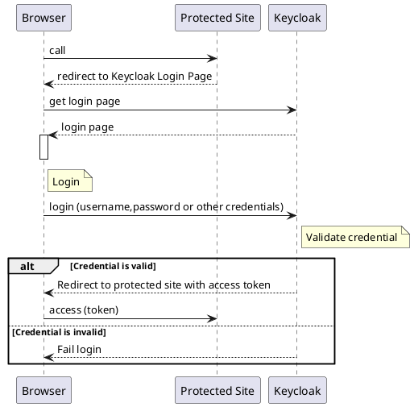
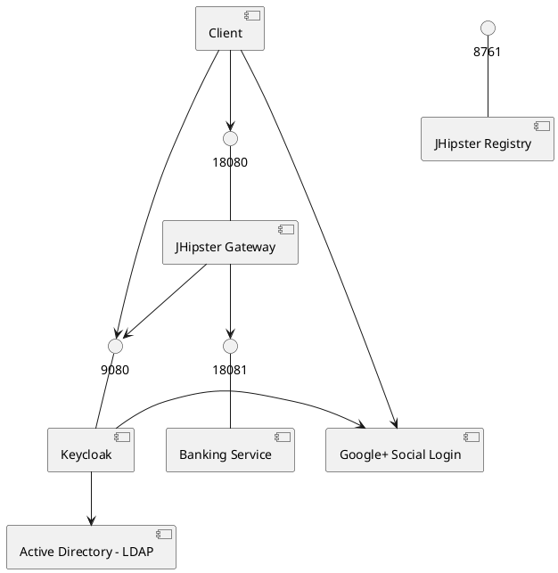
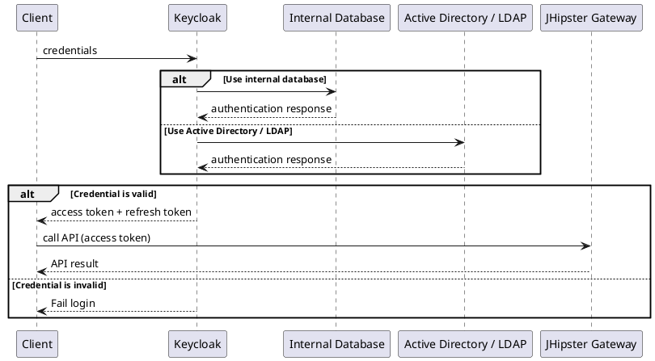
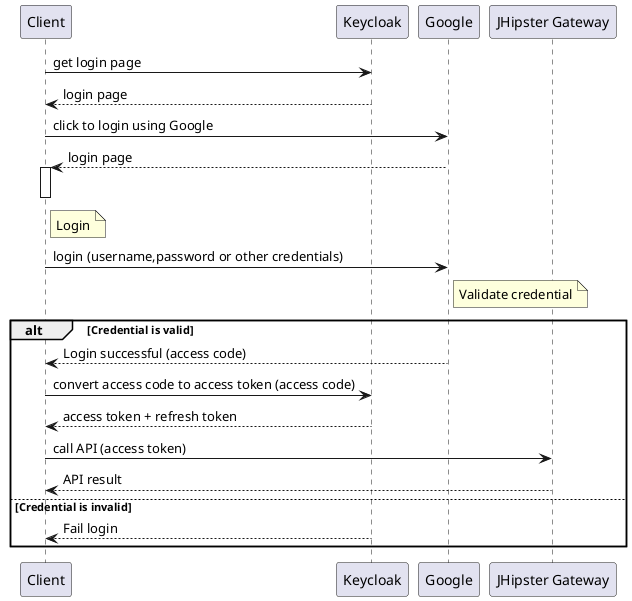

# Securing your APIs with JHipster and Keycloak 

## Introduction

This tutorial is basically my personal notes on getting JHipster and Keycloak to work together to cover several security use cases. We will implement user security through three different measures: user name and password, Active Directory and social login.

## How Keycloak and JHipster work together

Keycloak is an Identity and Access Management (IAM) that implements the OAuth2 standard 

More info: [What the Heck is OAuth?](https://developer.okta.com/blog/2017/06/21/what-the-heck-is-oauth)

Basically, Keycloak 'hides' our APIs behind its authetication 'wall'. Below is the flow followed by Keycloak when authenticating a user (Browser) trying to access a Page (called Protected Site)

Protecting JHipster API is a bit different because we need to limit the usage of browser (we will see later, for social login, this is inevitable)

##Architecture

There are several componts involved in making this works:

JHipster Registry does not play much role here. Mainly providing registration and look up service
 
###Direct Grants Flow (for Keycloak internal database or Active directory)
1) In Direct Grants Flow, credentials are passed directly from the client to Keycloak

2) Keycloak would either authenticate the user againts its own database or delegate the authentication. If successful, Keycloak will return an access token and a refresh token back to the client.

3) The client can then call the JHipster Gateway (and ultimately any service under the gateway - such as 'Banking Service') by passing the access token.

4) Once the access token has expired, the refresh token can be passed to get a new access token (and also a new refresh token)

###Authorization Code Grants Flow (for Social Login)
1) Social login pose a special challenge to APIs as we need to expose the login page of the Identity Providers (in our example, Google). So in case of Social Login, we cannot expect 100% 'page less' login. For this we rely on Authorization Code Grant. 

2) Client access Keycloak directly and click on a button to use Google Login. Google page will appear and they will login there. We will need to pre-configure a callback page. Once Google login is successful, this callback page (on the client side) is called - along with an authorization code

3) The client then need to call Keycloak to convert the access code into access and refresh token

4) Once access and refresh token is issued, the client can call JHipster Gateway (supplying the access token) just like in the Direct Grants Flow above.

##Installation
Note: The easiest way to install all these components (Keycloak, JHipster and all) is to use docker-compose. For this tutorial, we will not be using docker-compose since, as I said, these are my notes and my target deployment is not docker just yet.

###Installing Keycloak

